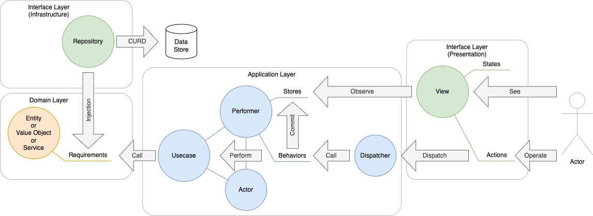

CALearning
==========

1. フォルダ構成
2. Viewの表示
3. ユースケースのコードによる表現
4. ドメインモデルの実装
5. プレゼンテーション層でのユースケース呼び出し
6. インフラ層と依存性逆転の原則
7. 振る舞い駆動開発
8. インフラ層／APIクライアント

# 1. アーキテクチャ概要

このチュートリアルでは、ドメイン駆動設計の流れを汲んだレイヤードアーキテクチャを実践しながら学びます。

このチュートリアルでは、アプリケーションを「ドメイン層」「アプリケーション層」「インタフェース層」の3つに分けて設計、実装していきます。

<dl>
<dt>ドメイン層</dt>
<dd>ドメイン（＝問題領域＝アプリで解決したいこと）の要求を満たす、ドメイン知識／ロジックを持ったオブジェクトを作成します。ドメイン知識／ロジックとは、コンピュータでなく人が紙とペンでアプリと同様のサービスを提供したとした場合でも必要になる知識やロジックです。実行環境から独立していて、例えばAndroidで同じアプリを作る場合にも（言語こそ違いますが）、そっくり移植できます。<br/>ドメイン層のオブジェクトはアプリケーション層／インタフェース層のオブジェクトを知っていてはいけません。<br/><br/></dd>
<dt>アプリケーション層</dt>
<dd>アクターおよびユースケースを実装し、アプリの振る舞いを決めるオブジェクトを作成します。<br/><br/></dd>
<dt>インタフェース層</dt>
<dd>例えば以下のような3つのインタフェースがあります。<dl><dt>UI</dt><dd>ユーザが見る画面であり、ユーザからの入力を受け取るViewオブジェクトを作成します。SwiftではSwiftUIで記述します。</dd><dt>システム間インタフェース</dt><dd>データを持つサーバーやデータストアに対する問い合わせを行うオブジェクトを作成します。ドメイン層のオブジェクトはデータを取り出す際にこれらのオブジェクトを利用することになりますが、ドメイン層のオブジェクトはインタフェース層のオブジェクトに依存してはいけません。そのためprotocolを作成し、依存関係を逆転させて実装します。</dd><dt>テストとのインタフェース</dt><dd>ドメインオブジェクトの機能テスト、アプリケーションオブジェクトの振る舞いテスト、ViewのUIテストを作成します。</dd>
</dl>





<dl>
<dt>Entity／エンティティ</dt><dd>概念として、取り扱いに同一性を意識する必要があるもの。例としてはユーザーアカウントやブログ記事などが挙げられる。連続性を意識する必要があり、トランザクション管理や時には履歴管理が必要な概念。</dd>
<dt>Value Object／バリューオブジェクト</dt><dd>概念として、取り扱いに同一性を意識する必要がないもの。</dd>
<dt>Service／サービス</dt><dd>EntityやValue Objectなどに持たせるには相応しくない状態を持たない操作。</dd>
<dt>Usecase／ユースケース</dt><dd>オブジェクト指向プログラミングで一般的に使われるユースケースに等しい。ここではユースケースを「様々なScene／シーンの組み合わせによって複数のScenario／シナリオを取り得るもの」と定義します。</dd>
<dt>Actor／アクター</dt><dd>オブジェクト指向プログラミングで一般的に使われるアクターに等しい。アクターはユーザだけでなく、アプリ自身がアクターとしてユースケースを実行することもあります。</dd>
<dt>Performer／パフォーマー</dt><dd>実行者の意。パフォーマーには、アクターによる特定のユースケースの実行をメソッドとして記述します。そのメソッドには、実行されたシナリオによって、アプリの状態（Store／ストア）がどう変わるかを記述します。<br/>パフォーマーが持つメソッドが、アプリの振る舞い（Behavior／ビヘィビア）であり、振る舞いテストでのテスト対象です。</dd>
<dt>Dispatcher／ディスパッチャー</dt><dd>通信指令係の意。Fluxアーキテクチャで使われるDispatchの概念をそのまま輸入しています。本アーキテクチャでは、ユーザによる操作時にユースケースの初めのシーン（initial scene）を引数にdispatchすることでユースケースを実行（＝パフォーマーの持つメソッドを呼び出し）するように実装します。</dd>
<dt>View／ビュー</dt><dd>画面表示の意。MVCパターンなど、多くのアーキテクチャで使われるViewの概念に等しい。Viewは値（アプリの状態＝Store）を書き換えることでリアクティブに表示が変わるテンプレートとして実装します。Storeの他、各Viewは自身特有の状態をStateとして保持します。</dd>
</dl>

Clean Architecture では、`Domain` と `Application` とその他（`Infrastructure`／`Presentation`）をレイヤーとして明確に分けます。ここでは、`Domain`／`Application`／`Infrastructure`／`Presentation` を Service 以下に、下記のように配置します。

```
CALearning
  ├─ Service
  │    ├─ Domain
  │    ├─ Application
  │    ├─ Infrastructure
  │    └─ Presentation
  ├─ System
  ├─ CALearningApp 
  └─ ContentView
```

その他、アーキテクチャの実装に必要なprotocolなどをまとめるためにSystemフォルダを用意しておきます。

# 2. Viewの表示

新規プロジェクト作成時点で、`View` として ContentView.swift が作られます。 ContentView はアプリの実体である CALearningApp から呼ばれています。

ここでは、ContentView はサービスの `View` の表示を制御するものとして利用することにし、`Viewコンテナ` と呼びます。

具体的には、アプリの状態に基づいてサービスの `View`、例えば splash／tutorial／login を出し分ける（＝遷移させる）ようにします。


## 1.1 Viewを作成する

Service/Presentation/Viewsフォルダを作成し、Splash.swift／Tutorial.swift／Login.swift の3つの SwiftUI View ファイルを新規作成します。
"Hello, World!"の替わりに"Splash"など、画面が分かる文言を表示するようにしましょう。
 
## 1.2 ルーティングを実装する

ContentViewが状態として、表示したいViewに対応するenumを保持するようにします。

```ContentView.swift

enum Views {
    case splash, tutorial, login
}

struct ContentView: View {
    var currentView: Views = .splash

    var body: some View {
        switch self.currentView {
        case .splash:
            Splash()
        case .tutorial:
            Tutorial()
        case .login:
            Login()
        }
    }
}
```

previewを表示させて、Splashが表示されていることを確認します。
currentViewの値を変えることで、TutorialやLoginが表示されていることを確認します。


# 3. ユースケースのコードによる表現

ここではユースケースをenumで表現します。例としてユースケース【アプリを起動する】を実装します。

## 3.1 ユースケースシナリオの記述

Service/Application/Usecasesフォルダを作成し、Boot.swift の Swift ファイルを新規作成します。

ユースケースシナリオの基本コース、代替コースおよびゴールとなるシーン（シナリオの中の一つの状態をここではシーンと呼ぶことにします）を以下のようにenumの入れ子で表現します。
デフォルト値としシナリオの初めのシーンをinit関数で定義します。


```Boot.swift
/// ユースケース【アプリを起動する】を実現します。
enum Boot {
    enum Basics {
        case アプリはユーザがチュートリアル完了の記録がないかを調べる
    }
    
    enum Alternatives {
    }
    
    enum Goals {
        case チュートリアル完了の記録がある場合_アプリはログイン画面を表示
        case チュートリアル完了の記録がない場合_アプリはチュートリアル画面を表示
    }
    
    case basic(scene: Basics)
    case alternate(scene: Alternatives)
    case last(scene: Goals)
    
    init() {
        self = .basic(scene: .アプリはユーザがチュートリアル完了の記録がないかを調べる)
    }
}
```

Swift の enum はとても強力で、入れ子にできたり、associated valueを持つことができたり、関数を持たせることができます。
@see: https://docs.swift.org/swift-book/LanguageGuide/Enumerations.html

## 3.2 ユースケースの実装

enumで定義したユースケースのシナリオを実行可能にします。
具体的には再起呼び出しを使って、シナリオの一つひとつ（ここではシーンと呼ぶことにします）を処理していくようにします。

System/Protocolsフォルダを作成し、Usecase.swift の Swiftファイルを新規作成します。

```Usecase.swift
import Combine

protocol Usecase {
    /// 自身が表すユースケースのSceneを実行した結果として、次のSceneがあれば次のSceneを返すFutureを、ない（シナリオの最後の）場合には nil を返します。
    func next() -> AnyPublisher<Self, Error>?
    
    /// 引数で渡されたSceneを次のSceneとして返します。
    /// next関数の実装時、特にドメイン的な処理がSceneが続く場合に使います。
    func just(next: Self) -> AnyPublisher<Self, Error>
    
    /// Usecaseに準拠するenumを引数に取り、再帰的にnext()を実行します。
    ///
    /// - Parameter contexts: ユースケースシナリオの（画面での分岐を除く）分岐をけcaseに持つenumのある要素
    /// - Returns: 引数のenumと同様のenumで、引数の分岐を処理した結果の要素
    func interact() -> AnyPublisher<[Self], Error>
}

extension Usecase {
    
    func just(next: Self) -> AnyPublisher<Self, Error> {
        return Deferred {
            Future<Self, Error> { promise in
                promise(.success(next))
            }
        }
        .eraseToAnyPublisher()
    }
    
    private func recursive(contexts: [Self]) -> AnyPublisher<[Self], Error> {
        guard let context = contexts.last else { fatalError() }
        
        // 終了条件
        guard let future = context.next() else {
            return Deferred {
                Future<[Self], Error> { promise in
                    promise(.success(contexts))
                }
            }
            .eraseToAnyPublisher()
        }
        
        // 再帰呼び出し
        return future
            .flatMap { nextContext -> AnyPublisher<[Self], Error> in
                var _contexts = contexts
                _contexts.append(nextContext)
                return self.recursive(contexts: _contexts)
            }
            .eraseToAnyPublisher()
    }
    
    func interact() -> AnyPublisher<[Self], Error> {
        return self.recursive(contexts: [self])
    }
}
```

CombineはReactiveX（RxSwift）のApple版で、非同期処理によるデータの変更を別の処理に伝播させるといった Reactiveプログラミングを実現するフレームワークです。
@see: https://developer.apple.com/documentation/combine


BootをUsecaseプロトコルを準拠するようにし、next関数を実装します。
next関数は、自身が表すシーンの次のシーンを返すように実装します。処理終了の場合には nil を返すようにします。

```Boot.swift
enum Boot : Usecase {
    ...
    
    func next() -> AnyPublisher<Boot, Error>? {
        switch self {
        case .basic(.アプリはユーザがチュートリアルを完了した記録がないかを調べる):
            // TODO
        case .last:
            return nil
        }
    }
```

例えば以下のようにし、detect関数の中でチュートリアルの完了記録があるか否かを調べることとします。

```Boot.swift
    func next() -> AnyPublisher<Boot, Error>? {
        switch self {
        case .basic(.アプリはユーザがチュートリアルを完了した記録がないかを調べる):
            return self.detect()
        case .last:
            return nil
        }
    }
```

```Boot.swift
    private func detect() -> AnyPublisher<Boot, Error> {
        // Deferredでsubscribesされてから実行されるようになる
        // Futureは一度だけ結果を返す
        return Deferred {
            Future<Boot, Error> { promise in
                // Futureが非同期になる場合、sinkする側ではcancellableをstoreしておかないと、
                // 非同期処理が終わる前にsubsciptionはキャンセルされてしまうので注意
                // @see: https://forums.swift.org/t/combine-future-broken/28560/2
                DispatchQueue.main.asyncAfter(deadline: .now() + 2){
                    if /* TODO: ドメインモデルが持つメソッドが結果を返すようにする */ {
                        promise(.success(.last(scene: .チュートリアル完了の記録がある場合_アプリはログイン画面を表示)))
                    } else {
                        promise(.success(.last(scene: .チュートリアル完了の記録がない場合_アプリはチュートリアル画面を表示)))
                    }
                }
            }
        }
        .eraseToAnyPublisher()
    }
```

ここではSplashを2秒表示させるものとして実装しています。

# 4. ドメインモデルの実装

一旦、ユースケースの実装は置いておいて、ドメインモデルを作成します。

## 4.1 ドメインモデルを作成する

様々な値をアプリが保持するので、アプリを表すドメインモデルをオブジェクトとして作成します。

Service/Domain/Modelsフォルダ作成し、Application.swift の Swiftファイルを新規作成します。

```Application.swift
class Application {

    var hasCompletedTutorial: Bool {
        get {
            // TODO
            return true
        }
        set {
            // TODO
        }
    }
}
```

一旦、呼ばれたら true を返すのみとします。
在るべき実装としては、データ読み書き用のプロトコルを宣言し、それを実装する形でインフラ層でデータ読み書き機能を実装し、それを使うようにします（6で行います）。

## 4.2 ドメインモデルを利用してユースケースを実装する


```Boot.swift
    private func detect() -> AnyPublisher<Boot, Error> {
        // Deferredでsubscribesされてから実行されるようになる
        // Futureは一度だけ結果を返す
        return Deferred {
            Future<Boot, Error> { promise in
                // Futureが非同期になる場合、sinkする側ではcancellableをstoreしておかないと、
                // 非同期処理が終わる前にsubsciptionはキャンセルされてしまうので注意
                // @see: https://forums.swift.org/t/combine-future-broken/28560/2
                DispatchQueue.main.asyncAfter(deadline: .now() + 2){
                    if Application().hasCompletedTutorial {
                        promise(.success(.last(scene: .チュートリアル完了の記録がある場合_アプリはログイン画面を表示)))
                    } else {
                        promise(.success(.last(scene: .チュートリアル完了の記録がない場合_アプリはチュートリアル画面を表示)))
                    }
                }
            }
        }
        .eraseToAnyPublisher()
    }
```

# 5. プレゼンテーション層でのユースケース呼び出し

ユーザの入力イベントなどをトリガーとして、プレゼンテーション層からユースケースを実行する必要があります。

## 5.1 ユースケースの実行

以下のように、Bootユースケースを初期化し、interact関数を実行し、結果をサブスクライブするようにします（これをどこに実装するかについては5.2参照）。
結果は実際に実行されたシーンの配列（これをscenarioと呼ぶことにします）で返ってくるので、その最後のシーンが何だったかによって、次の処理を変更します。

```swift
    Boot()
        .interact()
        .sink { completion in
            if case .finished = completion {
                print("boot は正常終了")
            } else if case .failure(let error) = completion {
                print("boot が異常終了: \(error)")
            }
        } receiveValue: { scenario in
            print("usecase - boot: \(scenario)")
            
            guard case .last(let goal) = scenario.last else { fatalError() }
            
            switch goal {
            case .チュートリアル完了の記録がある場合_アプリはログイン画面を表示:
                // TODO
             case .チュートリアル完了の記録がない場合_アプリはチュートリアル画面を表示:
                // TODO
            }
        }
```

## 5.2 ユースケースをどこから呼ぶべきか

拡張性の担保や再利用性を考えた場合、Viewは表示のために設定された値を表示するためのコードのみを持つべきです。
値を取得するためのコード、ユースケースの結果に応じて表示内容を加工するなどの処理は、別のオブジェクトで担うようにします。

ここではそれら、Viewから呼ばれてユースケースを実行し、その結果をViewに伝える（Viewが参照する値を保持する）役割をもつオブジェクトを`Presenter`とします。

## 5.3 Presenterの実装

先述の通り、「Viewは表示のために設定された値を表示するためのコードのみを持つべき」です。Viewを表示するには、ユーザに表示したい様々な値を設定してあげる必要があります。

この処理を、SwiftUIでは Swift5.1で導入された`Property Wrapper`という機能を使って実現しています。

`Property Wrapper` とは、プロパティの制御をテンプレート化したもので、SwiftUI でのView Modelとして `ObservableObject` などの `Property Wrapper` が用意されています。
@see: https://developer.apple.com/documentation/swiftui/managing-model-data-in-your-app

ここでは、`Presenter` を `ObservableObject` として実装します。


```Presenter.swift
import Combine

class Presenter: ObservableObject {
    
    private var cancellables = [AnyCancellable]()
    
    func boot() {
        Boot()
            .interact()
            .sink { completion in
                if case .finished = completion {
                    print("boot は正常終了")
                } else if case .failure(let error) = completion {
                    print("boot が異常終了: \(error)")
                }
            } receiveValue: { scenario in
                print("usecase - boot: \(scenario)")
                
                guard case .last(let goal) = scenario.last else { fatalError() }
                
                switch goal {
                case .チュートリアル完了の記録がある場合_アプリはログイン画面を表示:
                    // TODO
                 case .チュートリアル完了の記録がない場合_アプリはチュートリアル画面を表示:
                    // TODO
                }
            }
            .store(in: &cancellables)
    }
}
```

ユースケースの実行結果で遷移する画面を変更したいため、ContentViewで保持していた currentViewプロパティ を `Presenter` に移植します。


```Presenter.swift
class Presenter: ObservableObject {
    
    @Published var currentView: Views = .splash
    
    private var cancellables = [AnyCancellable]()
    
    func boot() {
        Boot()
            .interact()
            .sink { completion in
                if case .finished = completion {
                    print("boot は正常終了")
                } else if case .failure(let error) = completion {
                    print("boot が異常終了: \(error)")
                }
            } receiveValue: { scenario in
                print("usecase - boot: \(scenario)")

                guard case .last(let goal) = scenario.last else { fatalError() }
                
                switch goal {
                case .チュートリアル完了の記録がある場合_アプリはログイン画面を表示:
                    self.currentView = .login
                 case .チュートリアル完了の記録がない場合_アプリはチュートリアル画面を表示:
                    self.currentView = .tutorial
                }
            }
            .store(in: &cancellables)
    }
}
```

## 5.4 ViewとPresenterをつなぐ

`Presenter` を `ObservableObject` として作成しましたが、`ObservableObject` を View（SwiftUI）に繋ぐ方法には以下があります。

### 5.4.1 単一のViewとつなぐ（ライフサイクルなし）

以下のように `@StateObject` として宣言すると、作成されたプロパティは、Viewが書き変わっても値が保持されます。

```swift
struct ContentView: View {

    @StateObject var presenter = Presenter()
    ...
```

### 5.4.1 単一のViewとつなぐ（ライフサイクルあり）

以下のように `@ObservedObject` として宣言すると、作成されたプロパティは、Viewが書き変わると初期化されます。


```swift
struct ContentView: View {

    @ObservedObject var presenter = Presenter()
    ...
```

### 5.4.2 あるView以下の子孫すべてとつなぐ

以下のように、`.environmentObject`モディファイアで指定し、View側に `@EnvironmentObject`を用意すると、`.environmentObject`モディファイアで指定したView以下、すべての子孫で同一の `Presenter` を参照できます。

```CALearningApp.swift
@main
struct CALearningApp: App {

    @StateObject var presenter = Presenter()
    
    var body: some Scene {
        WindowGroup {
            ContentView()
                .environmentObject(presenter)
        }
    }
}
```
```ContentView.swift
struct ContentView: View {

    @EnvironmentObject var presenter: Presenter
    ...
}
``` 

ここでは `environmentObject` を選択します。

```CALearningApp.swift
@main
struct CALearningApp: App {

    @StateObject var presenter = Presenter()

    var body: some Scene {
        WindowGroup {
            ContentView()
                .environmentObject(presenter)
        }
    }
}
```

```ContentView.swift
struct ContentView: View {

    @EnvironmentObject var presenter: Presenter

    var body: some View {
        switch presenter.currentView {
        case .splash:
            Splash()
        case .tutorial:
            Tutorial()
        case .login:
            Login()
        }
    }
}
```

プレビューでは各Viewで直接追加しましょう。

```ContentView.swift
struct ContentView_Previews: PreviewProvider {
    static var previews: some View {
        ContentView()
            .environmentObject(Presenter())
    }
}
```


## 5.5 ViewからPresenterを経由してユースケースを実行する


アプリが起動されるとまずはSplash画面を表示し、ユースケース「ユーザはアプリを起動する」が実行されるようにします。
以下のように、Splash内で onAppearモディファイアを使ってPresenterのメソッドを呼び出します。

```Splash.swift
struct Splash: View {
    
    @EnvironmentObject var presenter: Presenter
    
    var body: some View {
        Text("Slash")
            .onAppear {
                self.presenter.boot()
            }
    }
}
```

Run でアプリを実行します。「Splash」が表示されてから、2秒後に「Login」と自動で変わり、画面遷移したことが確認できます。

また、以下のようにコンソールにログが出ています。

> usecase - boot: [CALearning.Boot.basic(scene: CALearning.Boot.Basics.アプリはユーザがチュートリアルを完了した記録がないかを調べる), CALearning.Boot.basic(scene: CALearning.Boot.Basics.チュートリアル完了の記録がある場合_アプリはログイン画面を表示)]
> boot は正常終了

これは usecase bootが実行され、基本コースの `アプリはユーザがチュートリアルを完了した記録がないかを調べる` → `チュートリアル完了の記録がある場合_アプリはログイン画面を表示` というシナリオを通ったことを示しています。


# 6. インフラ層と依存性逆転の原則

さて、ドメインモデルの実装に戻ります。
チュートリアルが終わっているか否かをドメインモデルであるApplicationが判断できるようにしたいですが、ここでデータ保存などのインフラ層に置くべきコードを書くのはご法度です。

そこで、依存性逆転の原則に則り、データ保存の仕様を決めるプロトコルを作成し、インフラ層でそれを実装するようにします。

Service/Domain/Interfacesフォルダを作成し、DataStore.swift の Swift ファイルを新規作成します。

```DataStore.swift
protocol Key: CaseIterable, RawRepresentable where Self.RawValue == String {
    associatedtype ValueType
}

enum KeyValue {

    enum BoolKey: String, Key {
        typealias ValueType = Bool
        case hasCompletedTutorial
    }
    
    case bool(key: BoolKey, value: BoolKey.ValueType)
}

protocol DataStore {

    /// データの保存
    func save(_ keyValue: KeyValue)

    /// データの取り出し
    func get<T: Key>(_ key: T) -> T.ValueType?

    /// データの削除
    func delete<T: Key>(_ key: T)
}
```

これを実装するため、Service/Infrastructureフォルダを作成し、UserDefaultsDataStore.swift の Swiftファイルを新規作成します。
ここではデータストアの実体としてUserDefaultsを使います。

```UserDefaultsDataStore.swift
struct UserDefaultsDataStore : DataStore {
    
    func save(_ keyValue: KeyValue) {
        switch keyValue {
        case .bool(let key, let value):
            UserDefaults.standard.set(value, forKey: key.rawValue)
        }
    }
    
    func get<T: Key>(_ key: T) -> T.ValueType? {
        return UserDefaults.standard
            .object(forKey: key.rawValue) as? T.ValueType
    }
    
    func delete<T: Key>(_ key: T) {
        UserDefaults.standard.removeObject(forKey: key.rawValue)
    }
}
```

ドメインモデルからインフラ層での実装を呼び出すため、実装を抽象化して保持するシングルトンオブジェクトを作成します。
Service/Domain 以下に Dependencies.swift のSwiftファイルを新規作成します。


```Dependencies.swift
struct Dependencies {
    // シングルトン
    static private(set) var shared: Dependencies = Dependencies()
    
    // 依存性逆転が必要なものが増えたら足していく
    private(set) var dataStore: DataStore
   
    init(
        dataStore: DataStore = UserDefaultsDataStore()
    ) {
        self.dataStore = dataStore
    }
    
    /// mockなどを差し込む際に使う
    func set(
        dataStore: DataStore? = nil
    ) {
        if let d = dataStore { Dependencies.shared.dataStore = d }
    }
}
```

ドメインモデル Application の hasCompletedTutorialの実装は以下のようになります。

```Application.swift
    var hasCompletedTutorial: Bool {
        get {
            if let value = Dependencies.shared.dataStore.get(KeyValue.BoolKey.hasCompletedTutorial) {
                return value
            } else {
                return false
            }
        }
        set {
            Dependencies.shared.dataStore.save(
                .bool(key: .hasCompletedTutorial, value: newValue)
            )
        }
    }
```


# 7. 振る舞い駆動開発

QuickおよびNimbleというパッケージをUnitTest用のターゲットに導入します。
Xcodeのメニューから、File > Add packages... を開き、右上の検索窓に以下を入力し、パッケージを追加します。

- https://github.com/Quick/Quick.git
- https://github.com/Quick/Nimble.git

SwiftPMのパッケージ検索は[ここ](https://swiftpackageindex.com/)で行えます。
追加する際に、どのTargetに追加するかを問われるので、UnitTestsを選択します。


ここではユースケース毎にSpecファイルを作成することにします。
Testsフォルダ以下に、`Unit Test Case Class`としてBootSpecをQuickSpecのサブクラスとして新規作成します。


```BootSpec.swift
import XCTest
@testable import CALearning

import Quick
import Nimble

class BootSpec: QuickSpec {

    override func spec() {
        let presenter = Presenter()
        
        describe("アプリを起動する") {
            context("チュートリアル完了の記録がある場合") {
                beforeEach {
                    presenter.currentView = .splash
                    Application().hasCompletedTutorial = true
                }
                it("アプリはログイン画面を表示") {
                    presenter.boot()
                    
                    expect(presenter.currentView)
                        .toEventually(equal(Views.login), timeout: .seconds(2))
                        
                }
            }
            context("チュートリアル完了の記録がない場合") {
                beforeEach {
                    presenter.currentView = .splash
                    Application().hasCompletedTutorial = false
                }
                it("アプリはチュートリアル画面を表示") {
                    presenter.boot()
                    
                    expect(presenter.currentView)
                        .toEventually(equal(Views.tutorial), timeout: .seconds(2))
                }
            }
        }
    }
}
```

describe にはユースケースを記述します。
context にはユースケースシナリオの分岐部分を記述します。
it には期待する結果を記述します。

itってなんやねん、というと、英語では it should be... と期待する結果を書くから it なのです。

ユースケースシナリオ＝仕様＝テストです。テストさえ書けば、詳細設計書は不要です（Tests as Documentation）。

このアーキテクチャでは、Viewがユーザの操作を受け付けるとPresenterを通してユースケースを実行するので、振る舞いテストとしては、Viewから呼ぶPresenterのメソッドを直接呼び出し、View Modelなどが期待する結果となっているかのアサーションを記述します。


もちろんユースケース以外にも、複雑なメソッドの機能テストも振る舞いを記述してテストをすることができます。

```swift
        describe("UserDefaultsDataStore.save") {
            context("引数が .bool(key: .hasCompletedTutorial, value: true )") {
                it("UserDefautlsに文字列キーhasCompletedTutorialで、trueが保存されること") {
                    UserDefaultsDataStore().save(.bool(key: .hasCompletedTutorial, value: true))
                    
                    expect(UserDefaults.standard.object(forKey: "hasCompletedTutorial") as? Bool).to(beTrue())
                    
                }
            }
            
            context("引数が .bool(key: .hasCompletedTutorial, value: false )") {
                it("UserDefautlsに文字列キーhasCompletedTutorialで、falseが保存されること") {
                    UserDefaultsDataStore().save(.bool(key: .hasCompletedTutorial, value: false))
                    
                    expect(UserDefaults.standard.object(forKey: "hasCompletedTutorial") as? Bool).to(beFalse())
                    
                }
            }
        }
        
        describe("UserDefaultsDataStore.delete") {
            context("引数が KeyValue.BoolKey.hasCompletedTutorial") {
                it("UserDefautlsに文字列キーhasCompletedTutorialが保存されていないこと") {
                    UserDefaultsDataStore().delete(KeyValue.BoolKey.hasCompletedTutorial)
                    
                    expect(UserDefaults.standard.object(forKey: "hasCompletedTutorial") as? Bool).to(beNil())
                    
                }
            }
        }
```

これは関数の仕様書であり、使い方のサンプルでもあります（Specification by Example）。


# 8. インフラ層／APIクライアント

インフラ層でのAPIクライアントの実装を通して、ユースケースの実装と依存性逆転の原則のさらなる実践を行いましょう。

まずは事前準備としてAlamofireというパッケージを導入します。
File > Add packages... を開き、検索窓に以下を入力し、パッケージを追加します。

- https://github.com/Alamofire/Alamofire.git

## 8.1 ユースケースシナリオの拡張

以下のように、ユースケース【アプリを起動する】を拡張します。
ここではアプリはサーバとAPIを通じて通信し、サーバ側で発行されたUDIDをアプリが保持する仕様とします。

```Boot.swift
enum Boot : Usecase {
    
    enum Basics {
        case アプリはサーバで発行したUDIDが保存されていないかを調べる
        case アプリはユーザがチュートリアルを完了した記録がないかを調べる(udid: String)
    }
    
    enum Alternatives {
        case UDIDがない場合_アプリはUDIDを取得する
    }
    
    enum Goals {
        case チュートリアル完了の記録がある場合_アプリはログイン画面を表示
        case チュートリアル完了の記録がない場合_アプリはチュートリアル画面を表示
    }
    
    ...
    
    func next() -> AnyPublisher<Boot, Error>? {
        switch self {
        case .basic(.アプリはサーバで発行したUDIDが保存されていないかを調べる):
            return self.checkUdid()
            
        case .basic(.アプリはユーザがチュートリアルを完了した記録がないかを調べる):
            return self.detect()

        case .alternate(.UDIDがない場合_アプリはUDIDを取得する):
            // TODO: UDIDを取得する
            // return self.publishUdid()
            
        case .last:
            return nil
        }
    }
```

サーバで発行したUDIDを、アプリはUserDefaultsに保存するものとします。
以下の様に、KeyValue に StringKey を追加します。

```DataStore.swift
enum KeyValue {

    enum BoolKey: String, Key {
        typealias ValueType = Bool
        case hasCompletedTutorial
    }
    
    enum StringKey: String, Key {
        typealias ValueType = String
        case udid
    }
    
    case bool(key: BoolKey, value: BoolKey.ValueType)
    case string(key: StringKey, value: StringKey.ValueType)
}
```

ドメインモデル `Application` に、UDIDを保存／読み出しする Computed Property を追加します。

```Application.swift
    private(set) var udid: String? {
        get {
            return Dependencies.shared.dataStore.get(KeyValue.StringKey.udid)
        }
        set {
            guard let udid = newValue else {
                return Dependencies.shared.dataStore.delete(KeyValue.StringKey.udid)
            }
            Dependencies.shared.dataStore.save(
                .string(key: .udid, value: udid)
            )
        }
    }
```

getは外部から行えるようにしつつも、setはApplicationからしか行えなえないように、アクセス修飾子を private(set) とします。
そして、setter 用のメソッドを用意します。

```Application.swift
    func save(udid: String) -> Void {
        self.udid = udid
    }
    
    func discardUdid() -> Void {
        self.udid = nil
    }
```

上記の Computed Property を使い、Bootが持つcheckUdid関数は以下のように実装します。

```Boot.swift
    private func checkUdid() -> AnyPublisher<Boot, Error> {
        return Deferred {
            Future<Boot, Error> { promise in
                guard let udid = Application().udid else {
                    return promise(.success(.alternate(scene: .UDIDがない場合_アプリはUDIDを取得する)))
                }
                promise(.success(.basic(scene: .アプリはユーザがチュートリアルを完了した記録がないかを調べる(udid: udid))))
            }
        }
        .eraseToAnyPublisher()
    }
```

## 8.2 エラーの定義

APIの定義に入っていく前に、エラーの定義を行いましょう。
ここでは、想定されるエラーは `サービスエラー`、想定しないエラーを `システムエラー` とします。

Swiftでは、エラーの定義は Errorプロトコルに準拠するenumで表現します。
Serviceフォルダ以下に ServiceErrors.swiftの、Systemフォルダ以下に SystemErrors.swiftの Swiftファイルを新規作成します。

```ServiceErrors.swift
enum ServiceErrors: Error {
    // TODO
}
```

```SystemErrors.swift
enum SystemErrors: Error {
    // TODO
}
```

また、これら２種類のエラーを共通して処理できるようにラップするエラーも用意します。

```SystemErrors.swift
enum ErrorWrapper: Error {
    case service(error: ServiceErrors, args: [String:Any]?, causedBy: Error?)
    case system(error: SystemErrors, args: [String:Any]?, causedBy: Error?)
}
```

argsにはエラー発生時の引数を、causedByには発生の元となるエラーがあれば指定できるようにします。

## 8.3 APIとAPIクライアントのプロトコル

SwiftにはCodableというプロトコルが用意されています。これは、例えばJSONで記述されたパラメータ群を、任意のデータ型に変換することができます。
APIのレスポンスとしてJSONを受け取る場合、Codableを利用することでレスポンスをstructに簡単に変換できます。

@see: https://developer.apple.com/documentation/foundation/archives_and_serialization/encoding_and_decoding_custom_types


ここでは APIは正常応答および異常応答として、それぞれ決まった型のデータを返すものとします。
正常応答はAPI毎に異なる型で、異常応答はHTTPステータスコードが400番以上であるものとし、全APIで型は共通とします。


上記の仕様の元、各APIは、以下のAPIプロトコルに準拠するように定義します。
System/Protocolsフォルダ以下に、Api.swift の Swiftファイルを新規作成します。

```Api.swift
import Alamofire

struct ErrorResponse: Codable, Error {
    let code: String
    let title: String
    let message: String
}

protocol Api {
    associatedtype Entity: Codable
    
    var method: HTTPMethod { get }
    var url: String { get }
    var headers: HTTPHeaders? { get }
    var params: [String: Any] { get }

    // サーバから戻ってきたJSONを専用の構造体に変更する
    func deserialize(_ json: Data) throws -> Entity
    func deserializeErrorResponse(_ json: Data) throws -> ErrorResponse
    // エラー発生時に問題解決の手掛かりにするなどのために、APIの情報をDictionaryで返します
    func description() -> [String:Any]
}

extension Api {
    
    func deserialize(_ json: Data) throws -> Entity {
        let decoder = JSONDecoder()
        decoder.dateDecodingStrategy = .iso8601 // 日付のデコードする際の形式を指定
        return try decoder.decode(Entity.self, from: json)
    }
    
    func deserializeErrorResponse(_ json: Data) throws -> ErrorResponse {
        let decoder = JSONDecoder()
        decoder.dateDecodingStrategy = .iso8601 // 日付のデコードする際の形式を指定
        return try decoder.decode(ErrorResponse.self, from: json)
    }
    
    func description() -> [String:Any] {
        return [
            "method"    : self.method.rawValue
            , "url"     : self.url
            , "headers" : self.headers.debugDescription
            , "params"  : self.params.debugDescription
        ]
    }
}
```

上記APIプロトコルを実装する実際のAPIを「実行する」APIクライアントのprotocolを作成します。
わざわざprotocolを作るのは、実際のAPIクライアントとは別にモックのAPIクライアントを作成し、テストなどで差し替え可能にするためです。

System/Protocolsフォルダ以下に、ApiClient.swift の Swiftファイルを新規作成します。

```ApiClient.swift
import Combine

protocol ApiClient {
    func call<T>(api: T) -> AnyPublisher<T.Entity, ErrorWrapper> where T: Api
}
```

## 8.4 APIとAPIクライアントの実装

実際に API を実装していきます。
ここでは、サーバ側でUDIDを発行する API を `POST`メソッド で定義します。

APIのエンドポイントは「http://localhost:8080/udids」とします。

Service/Infrastructureフォルダ以下に、Apis.swift の Swiftファイルを新規作成します。

```Apis.swift
import Alamofire

struct Apis {
    static let BASE_URL = "http://localhost:8000"
    static let DEFAULT_HEADERS = HTTPHeaders(["Content-Type" : "application/json"])
 
    /// 端末識別ID発行
    struct Udid: Api {
        typealias Entity = Response

        struct Response: Codable {
            let udid: String
        }

        let method = HTTPMethod.post
        let url = Apis.BASE_URL + "/udids"
        let headers: HTTPHeaders?
        let params: [String: Any]

        init(headers: HTTPHeaders? = Apis.DEFAULT_HEADERS) {
            self.params = ["appDeviceKbn" : 11]
            self.headers = headers
        }
    }
}
```

このAPIを実行するAPIクライアントをAlamofireを使って実装します。
System/Implementationsフォルダを作成し、AlamofireApiClient.swift の Swiftファイルを新規作成します。

```AlamofireApiClient.swift
import Combine
import Alamofire

class AlamofireApiClient: ApiClient {
    // 端末のネットワーク状況を検査するクラス
    private(set) var reachabilityManager: NetworkReachabilityManager?
    // ネットワークに接続されているか否か
    private(set) var reachablityStatus: NetworkReachabilityManager.NetworkReachabilityStatus = .unknown

    init() throws {
        // 通信状況の監視を起動
        guard let reachabilityManager = NetworkReachabilityManager() else {
            // TODO: システムエラー: APIクライントの初期化に失敗
        }
        
        reachabilityManager.startListening(onUpdatePerforming: { status in
            print("ReachabilityStatusが変わりました: \(self.reachablityStatus) -> \(status)")
            self.reachablityStatus = status
        })
        
        self.reachablityStatus = reachabilityManager.status
        self.reachabilityManager = reachabilityManager
    }
    
    func call<T>(api: T) -> AnyPublisher<T.Entity, ErrorWrapper> where T: Api {

        return Deferred {
            Future<T.Entity, ErrorWrapper> { promise in
                
                guard case .reachable(_) = self.reachablityStatus else {
                    // TODO: サービスエラー: ネットワーク接続不可
                }
                
                print(">>>>> API Request: \(api.url) with \(api.params)")
                
                AF.request(
                    api.url
                    , method: api.method
                    , parameters: api.params
                    , encoding: JSONEncoding.default
                    , headers: api.headers
                )
                    .validate(statusCode: 200..<300) // 正常系のレスポンスかどうかチェック
                    .responseDecodable(of: T.Entity.self) { response in
                        
                        switch response.result {
                        case .success(let entity):
                            promise(.success(entity))

                        case .failure(let error):

                            if case 400 = response.response?.statusCode
                                , let data = response.data
                            {
                                do {
                                    let errorResponse = try api.deserializeErrorResponse(data)
                                    // TODO: サービスエラー: エラーレスポンス 
                                } catch {
                                    // TODO: システムエラー: エラーレスポンスのデシリアライズに失敗
                                }
                            }
                            // TODO: システムエラー: その他のエラー
                        }
                }
            }
        }
        .eraseToAnyPublisher()
    }
}
```

エラーとして、

- システムエラー: APIクライントの初期化に失敗
- サービスエラー: ネットワーク接続不可
- サービスエラー: エラーレスポンス
- システムエラー: エラーレスポンスのデシリアライズに失敗
- システムエラー: その他のエラー

が必要となりました。以下のようにエラーを定義します。


```ServiceErrors.swift
enum ServiceErrors: Error {
    enum Client: Error {
        case ネットワーク接続不可
    }

    case client(_ error: Client)
    case server(_ error: ErrorResponse)
}
```

```SystemErrors.swift
enum SystemErrors: Error {
    enum Api: Error {
        case クライアントの初期化に失敗
        case エラーレスポンスのデシリアライズに失敗(responseJson: String)
        case その他のエラー(statusCode: Int?)
    }

    case api(_ error: Api)
}
```

これらを使い、AlamofireApiClientの実装は以下のようになります。

```AlamofireApiClient.swift
class AlamofireApiClient: ApiClient {
    ...
    init() throws {
        // 通信状況の監視を起動
        guard let reachabilityManager = NetworkReachabilityManager() else {
            throw SystemErrors.api(SystemErrors.Api.クライアントの初期化に失敗)
        }
        ...
    }
    
    func call<T>(api: T) -> AnyPublisher<T.Entity, ErrorWrapper> where T: Api {

        return Deferred {
            Future<T.Entity, ErrorWrapper> { promise in
                
                guard case .reachable(_) = self.reachablityStatus else {
                    return promise(.failure(
                        ErrorWrapper.service(error: ServiceErrors.client(.ネットワーク接続不可), args: api.description(), causedBy: nil)
                    ))
                }
                
                print(">>>>> API Request: \(api.url) with \(api.params)")
                
                AF.request(
                    api.url
                    , method: api.method
                    , parameters: api.params
                    , encoding: JSONEncoding.default
                    , headers: api.headers
                )
                    .validate(statusCode: 200..<300) // 正常系のレスポンスかどうかチェック
                    .responseDecodable(of: T.Entity.self) { response in
                        
                        switch response.result {
                        case .success(let entity):
                            promise(.success(entity))

                        case .failure(let error):

                            if case 400 = response.response?.statusCode
                                , let data = response.data
                            {
                                do {
                                    let errorResponse = try api.deserializeErrorResponse(data)
                                    return promise(.failure(
                                        ErrorWrapper.service(error: ServiceErrors.server(errorResponse), args: api.description(), causedBy: error)
                                    )) 
                                } catch {
                                    return promise(.failure(
                                        ErrorWrapper.system(error: SystemErrors.api(.エラーレスポンスのデシリアライズに失敗(responseJson: String(data: data, encoding: .utf8) ?? "※ 文字列への変換もできませんでした")), args: api.description(), causedBy: error)
                                    ))
                                }
                            }
                            promise(.failure(
                                ErrorWrapper.system(error: SystemErrors.api(.その他のエラー(statusCode: response.response?.statusCode)), args: api.description(), causedBy: error)
                            ))
                        }
                }
            }
        }
        .eraseToAnyPublisher()
    }
}
```

## 8.5 モックAPIクライアントの実装

APIクライアントを実装しましたが、APIサーバーがないと動作確認はできません。
ここではAPIクライントのモックを作成してドメインモデル、ユースケースの実装を進めましょう。

System/Implementations以下に、MockApiClient.swift の Swiftファイルを新規作成します。

```MockApiClient.swift
import Combine
import Alamofire

struct MockApiClient<U> : ApiClient where U: Api {
    
    enum ApiResult<T> where T : Api {
        case success(entity: T.Entity)
        case failure(by: ErrorWrapper)
    }

    let stub: ApiResult<U>

    init(stub: ApiResult<U>) {
        self.stub = stub
    }
    
    func call<T>(api: T) -> AnyPublisher<T.Entity, ErrorWrapper> where T: Api {

        return Deferred {
            Future<T.Entity, ErrorWrapper> { promise in
                guard let _api = api as? U else {
                    // TODO: システムエラー: 準備されたAPIスタブが呼び出されたAPIと合致しません
                }
                
                if case .success(let entity) = self.stub {
                    do {
                        let jsonEncoder = JSONEncoder()
                        jsonEncoder.dateEncodingStrategy = .iso8601
                        let data = try jsonEncoder.encode(entity)
                        let entity = try api.deserialize(data)
                        promise(.success(entity))
                    } catch let error {
                        // TODO: システムエラー: 準備されたAPIスタブのEncodeまたはDecodeに失敗
                    }
                } else if case .failure(let errorWrapper) = self.stub {
                    promise(.failure(errorWrapper))
                }
            }
        }
        .eraseToAnyPublisher()
    }
}
```

MockApiClientはAPIレスポンスのスタブとして正常応答および異常応答を初期化時に受け取るようにします。
正常応答が設定された場合には、スタブを一旦デコードしてからエンコードして返します。
異常応答が設定された場合には、それをそのまま返します。

ここで新たなシステムエラーの追加が必要になりました。以下のようにエラーを定義します。
上記の TODO 部分は自分で書いてみましょう。

```SystemErrors.swift
enum SystemErrors: Error {
    enum Api: Error {
        case クライアントの初期化に失敗
        case エラーレスポンスのデシリアライズに失敗(responseJson: String)
        case その他のエラー(statusCode: Int?)
    }
    
    enum MockApiClient: Error {
        case 準備されたAPIスタブが呼び出されたAPIと合致しません(message: String)
        case 準備されたAPIスタブのEncodeまたはDecodeに失敗(stub: String)
    }

    case api(_ error: Api)
    case mockApi(_ error: MockApi)
}
```

## 8.6 依存性逆転の原則

アプリは多くの場合、何らかのバックエンドを持ちます。それはNodeJSで実装されたAPIサーバーかもしれませんし、firebaseなどのBaasかもしれません。

バックエンド実装が何であろうと、ドメインモデルの実装を変える必要がないように、バックエンドもプロトコルを作成します。

Service/Domain/Interfacesフォルダに Backend.swift の Swift ファイルを新規作成します。

```Backend.swift
import Combine

protocol Backend {

    /// UDIDを発行します。
    func publishUdid() -> AnyPublisher<String, Error>
}
```

これを実装するApiBackendを作成します。 
Service/Infrastructureフォルダに、ApiBackend.swift の Swiftファイルを新規作成します。

```ApiBackend.swift
import Combine

struct ApiBackend : Backend {
    let apiClient: ApiClient
    
    init() throws {
        do {
            self.apiClient = try AlamofireApiClient()
        }
    }
    
    init(apiClient: ApiClient) {
        self.apiClient = apiClient
    }
    
    func publishUdid() -> AnyPublisher<String, Error> {
        self.apiClient.call(api: Apis.Udid())
            .map { response in
                return response.udid
            }
            .mapError { errorWrapper in
                return errorWrapper
            }
            .eraseToAnyPublisher()
    }
}
```

Dependenciesを以下のように拡張します。

```Dependencies.swift
struct Dependencies {
    ...
    
    // 依存性逆転が必要なものが増えたら足していく
    private(set) var dataStore: DataStore
    private(set) var backend: Backend
   
    init(
        dataStore: DataStore = UserDefaultsDataStore()
        , backend: Backend? = nil
    ) {
        self.dataStore = dataStore
        
        if let b = backend {
            self.backend = b
        } else {
            do {
                self.backend = try ApiBackend()
            } catch let error {
                // 在るべきはPreesntation層まで伝えてダイアログ表示などが適切
                fatalError(error.localizedDescription)
            }
        }
    }
    
    /// mockなどを差し込む際に使う
    func set(
        dataStore: DataStore? = nil
        , backend: Backend? = nil
    ) {
        if let d = dataStore { Dependencies.shared.dataStore = d }
        if let b = backend { Dependencies.shared.backend = b }
    }
}
```

`ApiBackend` は初期化時にエラーが発生することがあるので、Dependencies.init()のデフォルト引数で指定することができません。nilの場合には`ApiBackend`をインスタンス化するようにし、万一 `ApiBackend` の初期化に失敗した場合には アプリを終了するようにしています。

## 8.7 ドメインモデルの拡張とユースケースの実装

Backendオブジェクトを用いて`Application`には以下のメソッドを追加します。

```Application.swift
    func publishUdid() -> AnyPublisher<String, Error> {
        return Dependencies.shared.backend.publishUdid()
    }
```

`Boot`にて、TODOとしていた `publishUdid`メソッドの実装は以下のようになりまっす。

```Boot.swift
    private func publishUdid() -> AnyPublisher<Boot, Error> {
        return Application()
            .publishUdid()
            .map { udid -> Boot in
                Application().save(udid: udid)
                return .basic(scene: .アプリはユーザがチュートリアルを完了した記録がないかを調べる(udid: udid))
            }
            .eraseToAnyPublisher()
    }
```

## 8.8 モックとスタブによる動作確認

APIサーバーがまだない状況では、Backend実装をMockApiClientに差し替えて実行しましょう。
差し替えのタイミングはユースケース実行前で、ここでは`presenter`内とします。

```Presenter.swift
    func boot() {
        let apiClient = MockApiClient<Apis.Udid>(stub: .success(entity: Apis.Udid.Entity(udid: "hoge")))
        let backend = ApiBackend(apiClient: apiClient)
        Dependencies.shared.set(backend: backend)

        Application().discardUdid() // UDIDが保存されているとAPIが呼ばれないので消す
        
        Boot()
            .interact()
            ...
```

異常系を再現する場合にはstubを以下のように変更します。

```Presenter.swift
        let apiClient = MockApiClient<Apis.Udid>(stub: .failure(by: ErrorWrapper<Apis.Udid>.service(error: .client(.ネットワーク接続不可), args: Apis.Udid().description(), causedBy: nil)))
```

ここまで実装したことで、エラーは消えていると思います。
シミュレータで実行して確認してみましょう。

// 以上
