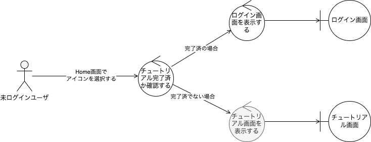

CALearning
==========

1. アーキテクチャ概要
2. フォルダ構成
3. Viewの表示
4. ユースケースのコードによる表現
5. ドメインモデルの実装
6. プレゼンテーション層でのユースケース呼び出し
7. インフラ層と依存性逆転の原則
8. 振る舞いのテスト

# 1. アーキテクチャ概要

このチュートリアルでは、ドメイン駆動設計の流れを汲んだレイヤードアーキテクチャを実践しながら学びます。

> 実装の前提として、ここでは割愛しますが、業務あるいはサービスの要求定義を行い、ドメインモデルの検討および、アクター毎のユースケースを一覧化し、それぞれのユースケースについて、ロバストネス分析を行っているものとします。


# 2. フォルダ構成

このチュートリアルのアーキテクチャでは前述の通り、`ドメイン層` と `アプリケーション層` と `インタフェース層`（UIやシステム間インタフェース、テストとのインタフェース）をレイヤーとして明確に分けます。ここでは、具体的に`Domain`、`Application`、`Infrastructure`、`Presentation` を Service 以下に、下記のように配置します。

```
CALearning
  ├─ Service
  │    ├─ Domain
  │    ├─ Application
  │    ├─ Infrastructure（システム間インタフェースの実装）
  │    └─ Presentation（UIの実装）
  ├─ System
  ├─ CALearningApp 
  └─ ContentView
```

その他、アーキテクチャの実装に必要なprotocolなどをまとめるためにSystemフォルダを用意しておきます。

# 3. Viewの表示

新規プロジェクト作成時点で、`View` として ContetView.swift が作られます。 ContetView はアプリの実体である CALearningApp から呼ばれています。

ここでは、ContentView はサービスの `View` の表示を制御するものとして利用することにします。

具体的には、アプリの状態に基づいてサービスの `View`、例えば splash／tutorial／login を出し分ける（＝遷移させる）ようにします。


## 3.1 Viewを作成する

Service/Presentation/Viewsフォルダを作成し、Splash.swift／Tutorial.swift／Login.swift の3つの SwiftUI View ファイルを新規作成します。
"Hello, World!"の替わりに"Splash"など、画面が分かる文言を表示するようにしましょう。
 
## 3.2 ルーティングを実装する

ContentViewが状態として、表示したいViewに対応するenumを保持するようにします。

```ContetView.swift

enum Views {
    case splash, tutorial, login
}

struct ContentView: View {
    var currentView: Views = .splash

    var body: some View {
        switch self.currentView {
        case .splash:
            Splash()
        case .tutorial:
            Tutorial()
        case .login:
            Login()
        }
    }
}
```

previewを表示させて、Splashが表示されていることを確認します。
currentViewの値を変えることで、TutorialやLoginが表示されていることを確認します。


# 4. ユースケースのコードによる表現

ここではユースケースをenumで表現します。

## 4.1 ユースケースのシーンを定義

Service/Application/Useasesフォルダを作成し、Boot.swift の Swiftファイルを新規作成します。
ここでは以下のようなユースケースを考えます。



ユースケースのシナリオとなる、基本コース／代替コースの各シーンを以下のようにenumの入れ子で表現します。


```Boot.swift
/// ユースケース【アプリを起動する】を実現します。
enum Boot {
    enum Basics {
        case ユーザはHome画面でアイコンを選択する
        case アプリはチュートリアル完了済かを確認する
    }
    
    enum Alternatives {}

    enum Goals {
        case 完了済の場合_アプリはログイン画面を表示する
        case 完了済でない場合_アプリはチュートリアル画面を表示する
    }
    
    case basic(scene: Basics)
    case alternate(scene: Alternatives)
    case last(scene: Goals)
}
```

Swift の enum はとても強力で、入れ子にできたり、associated valueを持つことができたり、関数を持たせることができます。

> @see: https://docs.swift.org/swift-book/LanguageGuide/Enumerations.html

## 4.2 ユースケースのシナリオを実装

enumで定義したユースケースの各シーンを繋いだシナリオを実行可能にします。
具体的には再起呼び出しを使って、一つひとつのシーンでの処理を連続して行うようにします。
非同期処理を逐次実行するために、各処理にはCombineのPublisherを使います。


System/Protocolsフォルダを作成し、Usecase.swift の Swiftファイルを新規作成します。

```Usecase.swift
import Combine

protocol Usecase {
    /// 自身が表すユースケースのSceneを実行した結果として、次のSceneがあれば次のSceneを返すFutureを、ない（シナリオの最後の）場合には nil を返します。
    func next() -> AnyPublisher<Self, Error>?
    
    /// 引数で渡されたSceneを次のSceneとして返します。
    /// next関数の実装時、特にドメイン的な処理がSceneが続く場合に使います。
    func just(next: Self) -> AnyPublisher<Self, Error>
    
    /// Usecaseに準拠するenumを引数に取り、再帰的にnext()を実行します。
    ///
    /// - Parameter contexts: ユースケースシナリオの（画面での分岐を除く）分岐をけcaseに持つenumのある要素
    /// - Returns: 引数のenumと同様のenumで、引数の分岐を処理した結果の要素
    func interacted() -> AnyPublisher<[Self], Error>
}

extension Usecase {
    
    func just(next: Self) -> AnyPublisher<Self, Error> {
        return Deferred {
            Future<Self, Error> { promise in
                promise(.success(next))
            }
        }
        .eraseToAnyPublisher()
    }
    
    private func recursive(scenario: [Self]) -> AnyPublisher<[Self], Error> {
        guard let context = scenario.last else { fatalError() }
        
        // 終了条件
        guard let future = context.next() else {
            return Deferred {
                Future<[Self], Error> { promise in
                    promise(.success(scenario))
                }
            }
            .receive(on: DispatchQueue.main) // sink後の処理はメインスレッドで行われるようにする
            .eraseToAnyPublisher()
        }
        
        // 再帰呼び出し
        return future
            .flatMap { nextScene -> AnyPublisher<[Self], Error> in
                var _scenario = scenario
                _scenario.append(nextScene)
                return self.recursive(scenario: _scenario)
            }
            .eraseToAnyPublisher()
    }
    
    func interacted() -> AnyPublisher<[Self], Error> {
        return self.recursive(scenario: [self])
    }
}
```

CombineはReactiveX（RxSwift）のApple版で、非同期処理によるデータの変更を別の処理に伝播させるといった Reactiveプログラミングを実現するフレームワークです。

> @see: https://developer.apple.com/documentation/combine


BootをUsecaseプロトコルを準拠するようにし、next関数を実装します。Swiftのextention機能を使えば、enumの定義とは切り離して実装することができます。
next関数は、自身が表すシーンの次のシーンを返すように実装します（戻り値の型にはBootの代わりにSelfが使えます）。処理終了の場合には nil を返すようにします。

```Boot.swift
extension Boot : Usecase {
    func next() -> AnyPublisher<Self, Error>? {
        switch self {
        case .basic(scene: .ユーザはHome画面でアイコンを選択する)
            // TODO
        case .basic(scene: .アプリはチュートリアル完了済かを確認する):
            // TODO
        case .last:
            return nil
        }
    }
}
```

例えば以下のようにし、detect関数の中でチュートリアルの完了記録があるか否かを調べることとします。

```Boot.swift
    func next() -> AnyPublisher<Self, Error>? {
        switch self {
        case .basic(scene: .ユーザはHome画面でアイコンを選択する)
            return self.just(next: .basic(.アプリはチュートリアル完了済かを確認する))
        case .basic(scene: .アプリはチュートリアル完了済かを確認する):
            return self.detect()
        case .last:
            return nil
        }
    }
```

```Boot.swift
    private func detect() -> AnyPublisher<Self, Error> {
        // Deferredでsubscribesされてから実行されるようになる
        // Futureは一度だけ結果を返す
        return Deferred {
            Future<Self, Error> { promise in
                // Futureが非同期になる場合、sinkする側ではcancellableをstoreしておかないと、
                // 非同期処理が終わる前にsubsciptionはキャンセルされてしまうので注意
                // @see: https://forums.swift.org/t/combine-future-broken/28560/2
                DispatchQueue.main.asyncAfter(deadline: .now() + 2){
                    if /* TODO: ドメインモデルが持つメソッドが結果を返すようにする */ {
                        promise(.success(.last(scene: .完了済の場合_アプリはログイン画面を表示する)))
                    } else {
                        promise(.success(.last(scene: .完了済でない場合_アプリはチュートリアル画面を表示する)))
                    }
                }
            }
        }
        .eraseToAnyPublisher()
    }
```

ここではSplashを2秒表示させるものとして実装しています。

# 5. ドメインモデルの実装

一旦ユースケースの実装は置いておいて、ドメインモデルを作成します。

## 5.1 ドメインモデルを作成する

業務やサービスを実現するためのドメイン（問題領域）の知識やルール、要求事項を、EntityやValue Objectなどのモノとして捉えられるオブジェクトとして、あるいはモノとして捉えられないものをServiceとして、ドメインモデルを作成します。

ここではアプリを一つのドメインモデルとして定義することとします。Service/Domain/Modelsフォルダ作成し、Application.swift の Swiftファイルを新規作成します。

Applicationはチュートリアルの完了記録を持たなければいけないため、ここではそれをComputed Propertyで実装することとします。

```Application.swift
struct Application {

    var hasCompletedTutorial: Bool {
        get {
            // TODO
            return true
        }
        set {
            // TODO
        }
    }
}
```

一旦、呼ばれたら true を返すのみとします。
在るべき実装としては、データ読み書き用のプロトコルを宣言し、それを実装する形でインフラ層でデータ読み書き機能を実装し、それを使うようにします（7で行います）。

## 5.2 ドメインモデルを利用してユースケースを実装する


```Boot.swift
    private func detect() -> AnyPublisher<Self, Error> {
        // Deferredでsubscribesされてから実行されるようになる
        // Futureは一度だけ結果を返す
        return Deferred {
            Future<Self, Error> { promise in
                // Futureが非同期になる場合、sinkする側ではcancellableをstoreしておかないと、
                // 非同期処理が終わる前にsubsciptionはキャンセルされてしまうので注意
                // @see: https://forums.swift.org/t/combine-future-broken/28560/2
                DispatchQueue.main.asyncAfter(deadline: .now() + 2){
                    if Application().hasCompletedTutorial {
                        promise(.success(.last(scene: .完了済の場合_アプリはログイン画面を表示する)))
                    } else {
                        promise(.success(.last(scene: .完了済でない場合_アプリはチュートリアル画面を表示する)))
                    }
                }
            }
        }
        .eraseToAnyPublisher()
    }
```

# 6. プレゼンテーション層でのユースケース呼び出し

ユーザの入力イベントなどをトリガーとして、プレゼンテーション層からユースケースを実行する必要があります。

## 6.1 ユースケースの実行

以下のように、Bootユースケースを初期化し、interacted関数を実行し、結果をサブスクライブするようにします（これをどこに実装するかについては後述します）。
結果は実際に実行されたシーンの配列（これをscenarioと呼ぶことにします）で返ってくるので、その最後のシーンが何だったかによって、次の処理を変更します。

```swift
    Boot.basic(scene: .ユーザはHome画面でアイコンを選択する)
        .interacted()
        .sink { completion in
            if case .finished = completion {
                print("boot は正常終了")
            } else if case .failure(let error) = completion {
                print("boot が異常終了: \(error)")
            }
        } receiveValue: { scenario in
            print("usecase - boot: \(scenario)")
            guard case let .last(scene) = scenario.last else { fatalError() }

            switch scene {
            case .完了済の場合_アプリはログイン画面を表示する:
                // TODO

            case .完了済でない場合_アプリはチュートリアル画面を表示する:
                // TODO
            }
        }
```

## 6.2 ユースケースをどこから呼ぶべきか

拡張性の担保や再利用性を考えた場合、Viewは表示のために設定された値を表示するためのコードのみを持つべきです。
値を取得するためのコード、ユースケースの結果に応じて表示内容を加工するなどの処理は、別のオブジェクトで担うようにします。

ここでは `View` から呼ばれてユースケースを実行し、その結果による値の更新をするオブジェクトとして `Performer` を用意します。`View` は `Performer` の持つ値を監視することで、Reactiveに書き換わるように実装します。

## 6.3 Performerの実装

先述の通り、「`View`は表示のために設定された値を表示するためのコードのみを持つべき」です。`View`を表示するには、ユーザに表示したい様々な値を設定してあげる必要があります。

この処理を、SwiftUIでは Swift5.1で導入された`Property Wrapper`という機能を使って実現しています。

`Property Wrapper` とは、プロパティの制御をテンプレート化したもので、SwiftUI でのView Modelとして `ObservableObject` などの `Property Wrapper` が用意されています。

> @see: https://developer.apple.com/documentation/swiftui/managing-model-data-in-your-app

ここでは、`Performer` を `ObservableObject` として、Service/Application以下に実装します。


```Performer.swift
import Combine

class Performer: ObservableObject {
    private var cancellables = [AnyCancellable]()
    
    func boot(from initialScene: Boot) {
        initialScene
            .interacted()
            .sink { completion in
                if case .finished = completion {
                    print("boot は正常終了")
                } else if case .failure(let error) = completion {
                    print("boot が異常終了: \(error)")
                }
            } receiveValue: { scenario in
                print("usecase - boot: \(scenario)")
                guard case let .last(scene) = scenario.last else { fatalError() }

                switch scene {
                case .完了済の場合_アプリはログイン画面を表示する:
                    // TODO

                case .完了済でない場合_アプリはチュートリアル画面を表示する:
                    // TODO
                }
            }
            .store(in: &cancellables)
    }
}
```

ユースケースの実行結果で遷移する画面を変更したいため、ContetViewで保持していた currentViewプロパティ を `Performer` に移植します。currentViewプロパティはViewで勝手に書き換えられないように、private(set) としておきます。


```Performer.swift
class Performer: ObservableObject {
    @Published private(set) var currentView: Views = .splash
    
    private var cancellables = [AnyCancellable]()
    
    func boot(from initialScene: Boot) {
        initialScene
            .interacted()
            .sink { completion in
                if case .finished = completion {
                    print("boot は正常終了")
                } else if case .failure(let error) = completion {
                    print("boot が異常終了: \(error)")
                }
            } receiveValue: { scenario in
                print("usecase - boot: \(scenario)")
                guard case let .last(scene) = scenario.last else { fatalError() }

                switch scene {
                case .完了済の場合_アプリはログイン画面を表示する:
                    self.currentView = .login

                case .完了済でない場合_アプリはチュートリアル画面を表示する:
                    self.currentView = .tutorial
                }
            }
            .store(in: &cancellables)
    }
}
```

## 6.4 ViewとPerformerをつなぐ

`Performer` を `ObservableObject` として作成しましたが、`ObservableObject` を View（SwiftUI）に繋ぐ方法には以下があります。

### 6.4.1 単一のViewとつなぐ（ライフサイクルなし）

以下のように `@StateObject` として宣言すると、作成されたプロパティは、Viewが書き変わっても値が保持されます。

```swift
struct ContentView: View {

    @StateObject var performer = Performer()
    ...
```

### 6.4.1 単一のViewとつなぐ（ライフサイクルあり）

以下のように `@ObservedObject` として宣言すると、作成されたプロパティは、Viewが書き変わると初期化されます。


```swift
struct ContentView: View {

    @ObservedObject var performer = Performer()
    ...
```

### 6.4.2 あるView以下の子孫すべてとつなぐ

以下のように、`.environmentObject`モディファイアで指定し、View側に `@EnvironmentObject`を用意すると、`.environmentObject`モディファイアで指定したView以下、すべての子孫で同一の `Performer` を参照できます。

```CALearningApp.swift
@main
struct CALearningApp: App {

    @StateObject var performer = Performer()
    
    var body: some Scene {
        WindowGroup {
            ContentView()
                .environmentObject(performer)
        }
    }
}
```
```ContentView.swift
struct ContentView: View {

    @EnvironmentObject var performer: Performer
    ...
}
``` 

ここでは `environmentObject` を選択します。

```CALearningApp.swift
@main
struct CALearningApp: App {

    @StateObject var performer = Performer()

    var body: some Scene {
        WindowGroup {
            ContentView()
                .environmentObject(performer)
        }
    }
}
```

```ContentView.swift
struct ContentView: View {

    @EnvironmentObject var performer: Performer

    var body: some View {
        switch performer.currentView {
        case .splash:
            Splash()
        case .tutorial:
            Tutorial()
        case .login:
            Login()
        }
    }
}
```

プレビューでは各Viewで直接追加しましょう。

```ContentView.swift
struct ContentView_Previews: PreviewProvider {
    static var previews: some View {
        ContentView()
            .environmentObject(Performer())
    }
}
```


## 6.5 ViewからPerformerを経由してユースケースを実行する


アプリが起動されるとまずはSplash画面を表示し、ユースケース「アプリを起動する」が実行されるようにします。
以下のように、Splash内で onAppearモディファイアを使ってPerformerのメソッドを呼び出します。

```Splash.swift
struct Splash: View {
    
    @EnvironmentObject var performer: Performer
    
    var body: some View {
        Text("Slash")
            .onAppear {
                self.performer.boot(from .basic(scene: .ユーザはHome画面でアイコンを選択する))
            }
    }
}
```

Run でアプリを実行します。「Splash」が表示されてから、2秒後に「Login」と自動で変わり、画面遷移したことが確認できます。

また、以下のようにコンソールにログが出ています。

> usecase - boot: [CALearning.Boot.basic(scene: CALearning.Boot.Basics.ユーザはHome画面でアイコンを選択する), CALearning.Boot.basic(scene: CALearning.Boot.Basics.アプリはチュートリアル完了済かを確認する), CALearning.Boot.last(scene: CALearning.Boot.Goals.完了済でない場合_アプリはチュートリアル画面を表示する)]
> boot は正常終了

これはユースケース Boot が実行され、基本コースの `ユーザはHome画面でアイコンを選択する` → `アプリはチュートリアル完了済かを確認する` → `完了済でない場合_アプリはチュートリアル画面を表示する` というシナリオを通ったことを示しています。


# 7. インフラ層と依存性逆転の原則

さて、ドメインモデルの実装に戻ります。

チュートリアルが終わっているか否かをドメインモデルであるApplicationが判断できるようにしたいですが、ここでデータ保存などのインフラ層に置くべきコードを書くのはご法度です。

そこで、依存性逆転の原則に則り、データ保存の仕様を決めるプロトコルを作成し、インフラ層でそれを実装するようにします。

Service/Domain/Interfacesフォルダを作成し、DataStore.swift の Swift ファイルを新規作成します。

```DataStore.swift
protocol Key: CaseIterable, RawRepresentable where Self.RawValue == String {
    associatedtype ValueType
}

enum KeyValue {

    enum BoolKey: String, Key {
        typealias ValueType = Bool
        case hasCompletedTutorial
    }
    
    case bool(key: BoolKey, value: BoolKey.ValueType)
}

protocol StoreInterface {

    /// データの保存
    func save(_ keyValue: KeyValue)

    /// データの取り出し
    func get<T: Key>(_ key: T) -> T.ValueType?

    /// データの削除
    func delete<T: Key>(_ key: T)
}
```

これを実装するため、Service/Infrastructureフォルダを作成し、UserDefaultsDataStore.swift の Swiftファイルを新規作成します。
ここではデータストアの実体としてUserDefaultsを使います。

```UserDefaultsDataStore.swift
struct UserDefaultsDataStore : DataStore {
    
    func save(_ keyValue: KeyValue) {
        switch keyValue {
        case .bool(let key, let value):
            UserDefaults.standard.set(value, forKey: key.rawValue)
        }
    }
    
    func get<T: Key>(_ key: T) -> T.ValueType? {
        return UserDefaults.standard
            .object(forKey: key.rawValue) as? T.ValueType
    }
    
    func delete<T: Key>(_ key: T) {
        UserDefaults.standard.removeObject(forKey: key.rawValue)
    }
}
```

ドメインモデルからインフラ層での実装を呼び出すため、実装を抽象化して保持するシングルトンオブジェクトを作成します。
Service/Domain 以下に Dependencies.swift のSwiftファイルを新規作成します。


```Dependencies.swift
struct Dependencies {
    // シングルトン
    static private(set) var shared: Dependencies = Dependencies()
    
    // 依存性逆転が必要なものが増えたら足していく
    var dataStore: DataStore
   
    init(
        dataStore: DataStore = UserDefaultsDataStore()
    ) {
        self.dataStore = dataStore
    }
    
    /// mockなどを差し込む際に使う
    func set(mock: Dependencies) {
        Dipendencies.shared = mock
    }
}
```

ドメインモデル Application の hasCompletedTutorialの実装は以下のようになります。

```Application.swift
    var hasCompletedTutorial: Bool {
        get {
            if let value = Dependencies.shared.dataStore.get(KeyValue.BoolKey.hasCompletedTutorial) {
                return value
            } else {
                return false
            }
        }
        set {
            Dependencies.shared.dataStore.save(
                .bool(key: .hasCompletedTutorial, value: newValue)
            )
        }
    }
```


# 8. 振る舞いのテスト

QuickおよびNimbleというパッケージをUnitTest用のターゲットに導入します。
Xcodeのメニューから、File > Add packages... を開き、右上の検索窓に以下を入力し、パッケージを追加します。

- https://github.com/Quick/Quick.git
- https://github.com/Quick/Nimble.git

SwiftPMのパッケージ検索は[ここ](https://swiftpackageindex.com/)で行えます。
追加する際に、どのTargetに追加するかを問われるので、UnitTestsを選択します。


ここではユースケース毎にSpecファイルを作成することにします。
Testsフォルダ以下に、`Unit Test Case Class`としてBootSpecをQuickSpecのサブクラスとして新規作成します。


```BootSpec.swift
import XCTest
@testable import CALearning

import Quick
import Nimble

class BootSpec: QuickSpec {

    override func spec() {
        describe("アプリを起動する") {
            context("ユーザはHome画面でアイコンを選択する") {
                context("アプリはチュートリアル完了済かを確認する") {
                    context("完了済の場合") {
                        let performer = Performer()
                        beforeEach {
                            Application().hasCompletedTutorial = true
                        }
                        it("アプリはログイン画面を表示する") {
                            performer.boot(from:.basic(scene: .ユーザはHome画面でアイコンを選択する))
                            
                            expect(performer.currentView)
                                .toEventually(equal(Views.login), timeout: .seconds(3)) // Bootで2秒待たせているので、それより長くすること
                                
                        }
                    }
                    context("完了済でない場合") {
                        let performer = Performer()
                        beforeEach {
                            Application().hasCompletedTutorial = false
                        }
                        it("アプリはチュートリアル画面を表示する") {
                            performer.boot(from:.basic(scene: .ユーザはHome画面でアイコンを選択する))
                            
                            expect(performer.currentView)
                                .toEventually(equal(Views.tutorial), timeout: .seconds(3)) // Bootで2秒待たせているので、それより長くすること
                        }
                    }
                }
            }
        }
    }
}
```

describe にはユースケースを記述します。
context にはユースケースシナリオの分岐部分を記述します。
it には期待する結果を記述します。

itってなんやねんというと、英語では it should be... と期待する結果を書くから it なのだそうです。

ユースケースシナリオ＋値の更新＝アプリの振る舞い＝仕様＝テストです。テストさえ書けば、詳細設計書は不要です（Tests as Documentation）。

このアーキテクチャでは、Viewがユーザの操作を受け付けるとPerformerを通してユースケースを実行するので、振る舞いテストとしては、Viewから呼ぶPrformerのメソッドを直接呼び出し、@Publishを付けたプロパティが期待する結果となっているかのアサーションを記述します。

テストを起動すると、アプリが起動するため、そのままでは【アプリを起動する】のユースケースが、アプリの実装とテストとで二重で実施されてしまいます。
そこで、テスト時には以下のように、アプリの表示を行わないようにします。

```CALerningApp.swift
let IS_TEST = ProcessInfo.processInfo.environment["IS_TEST"] == "true"

@main
struct CALearningApp: App {
    
    @StateObject var performer = Performer()
    
    var body: some Scene {
        WindowGroup {
            if !IS_TEST {
                ContentView()
                    .environmentObject(performer)
            } else {
                Text("Testing...")
            }
        }
    }
}
```

環境変数は、Edit Schema > Test > Arguments > Environment Variables から設定できます（Use the Run action's arguments and environment variablesのチェックは外して下さい）。


もちろんユースケース以外にも、複雑なメソッドの機能テストも振る舞いを記述してテストをすることができます。

```swift
    describe("UserDefaultsDataStore.save") {
        context("引数が .bool(key: .hasCompletedTutorial, value: true )") {
            it("UserDefautlsに文字列キーhasCompletedTutorialで、trueが保存されること) {
                UserDefaultsDataStore().save(.bool(key: .hasCompletedTutorial, value: true))
                
                expect {
                    guard let result = UserDefaults.standard.object(forKey: "hasCompletedTutorial") as? Bool else {
                        return .failed(reason: "hasCompletedTutorialをキーとする値がありません")
                    }
                }.to(beTrue())
                    
            }
        }
    }
```

これは関数の仕様書であり、使い方のサンプルでもあります（Specification by Example）。

// 以上
